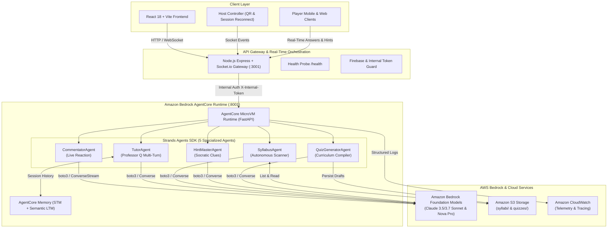

# Quiz Arena — Strands Agents & Amazon Bedrock AgentCore Architecture

## Executive Overview
Quiz Arena uses the **Strands Agents SDK** natively coupled with **Amazon Bedrock** foundation models (such as Anthropic Claude 3.5 Sonnet / 3.7 Sonnet and Amazon Nova Pro), deployed and managed on **Amazon Bedrock AgentCore**.



---

## 1. Strands Agents SDK Integration

The AI agents in Quiz Arena are built with the **Strands Agents SDK** (`strands-agents`), an open-source Python framework designed for model-driven agentic workflows and tool-calling loops.

### Foundation Model Binding: Amazon Bedrock
Each agent is bound to Amazon Bedrock via the native `BedrockModel` class:

```python
from strands import Agent
from strands.models import BedrockModel

# Primary model: Anthropic Claude 3.5 Sonnet on Amazon Bedrock
model = BedrockModel(
    model_id=os.environ.get("BEDROCK_MODEL_ID", "anthropic.claude-3-5-sonnet-20241022-v2:0"),
    region_name=os.environ.get("AWS_REGION", "us-east-1"),
    temperature=0.7
)
```

### The 5 Strands Agents in Quiz Arena
1. **CommentatorAgent (`/commentary`)**:
   - High-energy, sarcastic host delivering instant commentary on player hot streaks, cold streaks, and podium shifts.
   - Connected to the live game via the `receive_game_event` tool.
2. **TutorAgent (`/tutor`)**:
   - "Professor Q", a warm, multi-turn AI tutor that explains why a player's answer was incorrect and helps them learn the core concept.
   - Retains conversation state across follow-up questions via session memory.
3. **SyllabusAgent (`/syllabus/trigger`)**:
   - Autonomous background agent equipped with 4 tools (`list_syllabus_files`, `read_syllabus_file`, `list_existing_quizzes`, `save_quiz_draft`).
   - Automatically scans available course documents and produces pending quiz drafts for teacher review.
4. **HintMasterAgent (`/hint`)**:
   - In-game hint provider that uses the `analyze_question` tool to study the options and craft a subtle, Socratic clue without ever spoiling the answer.
5. **QuizGeneratorAgent (`/generate-quiz`)**:
   - Generates structured, verified multiple-choice questions from lecture notes or user-specified topics with balanced difficulty and explanatory rationales.

---

## 2. Amazon Bedrock AgentCore Deployment

**Amazon Bedrock AgentCore** provides enterprise-grade serverless hosting, runtime isolation, memory persistence, and tool connectivity for AI agents.

### Manifest Configuration (`agentcore.yaml`)
The deployment configuration is maintained in `server/strands_agents/agentcore.yaml`:
- **Runtime Environment**: Python 3.11 microVM container with health check probing `/health`.
- **Declared Agent Capabilities**: Declares each agent's role, system prompt expectations, tool signatures, and token budgets.
- **AgentCore Memory Integration**: Configures semantic and summarization memory strategies for multi-turn student tutoring.
- **Security & Authorization**: Enforces internal token verification (`X-Internal-Token`) so agent endpoints cannot be directly accessed from the public internet.

### One-Click CLI Deployment
To deploy the Strands agents to Amazon Bedrock AgentCore:
```bash
# 1. Install the AgentCore CLI
npm install -g @aws/agentcore

# 2. Deploy using the manifest
cd server/strands_agents
agentcore deploy --config agentcore.yaml --region us-east-1
```

Or deploy via the automated deployment scripts:
- Linux / macOS: `./server/strands_agents/deploy_agentcore.sh`
- Windows PowerShell: `.\server\strands_agents\deploy_agentcore.ps1`

---

## 3. Defense-in-Depth Security

1. **Network Isolation**: The Strands Python service runs on port `8001` which is never exposed to the public internet. All traffic flows through the Node.js API Gateway on port `3001`.
2. **Internal Shared Secret**: Every request between the gateway and the Strands service includes `X-Internal-Token`. Unauthenticated requests are rejected with `HTTP 401`.
3. **Tool Input Sanitization**: The `sanitize()` utility strips control characters (`\x00-\x1F`), angle brackets, and quotes before passing data to agents or filesystem/S3 tools.
4. **Path-Traversal Protection**: The `_QUIZ_FILENAME_RE` regex strictly enforces filenames matching `quiz_<8 hex chars>_<safe topic>.json`, preventing directory traversal attempts (`../../`).
5. **Anti-Cheat Mechanics**: The gateway strips `correctIndex` from socket payloads during the `QUESTION` phase, preventing inspection of answer keys in browser developer tools.
